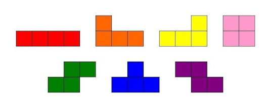

# Тетрис

## Резюме 
В данном проекте реализована игра «Тетрис» на языке программирования С с использованием структурного подхода.

## Содержание

  - [Введение](#введение)
  - [Информация о проекте](#информация-о-проекте)
    - [Общая информация](#общая-информация)
    - [Конечные автоматы](#конечные-автоматы)
    - [Фигуры](#фигуры)
    - [Подсчет очков и рекорд в игре](#подсчет-очков-и-рекорд-в-игре)
    - [Механика уровней](#механика-уровней)
    - [Управление](#управление)
  - [Инструкции по запуску](#инструкции-по-запуску)

## Введение

Проект состоит из двух частей: библиотеки, реализующей логику работы игры и терминального интерфейса с использованием библиотеки `ncurses`. Логика работы библиотеки реализована с использованием конечных автоматов.

## Информация о проекте
### Общая информация

- Программа разработана на языке Си стандарта C11 с использованием компилятора gcc.
- Код программы придерживается Google Style.
- Обеспечено покрытие библиотеки unit-тестами, с помощью библиотеки `check`.

- При заполнении линии, она уничтожается и происходит начисление очков;
- При достижении верхней границы игрового поля игра завершается;
- Игровое поле соответствует размерам игрового поля консоли — десять «пикселей» в ширину и двадцать «пикселей» в высоту.
- Фигура, после достижения нижней границы поля или соприкосновения с другой фигурой, остановливается. После этого происходит генерация случайной следующей фигуры.

### Конечные автоматы

Конечный автомат (КА) в теории алгоритмов — математическая абстракция, модель дискретного устройства, имеющего один вход, один выход и в каждый момент времени находящегося в одном состоянии из множества возможных.

При работе на вход КА последовательно поступают входные воздействия, а на выходе КА формирует выходные сигналы. Переход из одного внутреннего состояния КА в другое может происходить не только от внешнего воздействия, но и самопроизвольно.

КА можно использовать для описания алгоритмов, позволяющих решать те или иные задачи, а также для моделирования практически любого процесса. 

**_Конечный автомат для данной игры:_**

**_Данный КА состоит из следующих состояний:_**

- **Start** — состояние, в котором игра ждет, пока игрок нажмет кнопку готовности к игре.
- **Spawn** — состояние, в которое переходит игра при создании очередного блока и выбора следующего блока для спавна.
- **Moving** — основное игровое состояние с обработкой ввода от пользователя — поворот блоков/перемещение блоков по горизонтали.
- **Shifting** — состояние, в которое переходит игра после истечения таймера. В нем текущий блок перемещается вниз на один уровень.
- **Attaching** — состояние, в которое преходит игра после «соприкосновения» текущего блока с уже упавшими или с землей. Если образуются заполненные линии, то она уничтожается и остальные блоки смещаются вниз. Если блок остановился в самом верхнем ряду, то игра переходит в состояние «игра окончена».
- **Game over** — игра окончена.
- **Pause** - состояние паузы, из которого в любой момент можно продолжить игру с сохраненным состоянием

### Фигуры

#### _Используемые фигуры:_

### Подсчет очков и рекорд в игре

**В игре есть следующие механики:**

- подсчет очков;
- хранение максимального количества очков.

Данная информация передаётся и выводится пользовательским интерфейсом в боковой панели. Максимальное количество очков хранится в файле и сохраняется между запусками программы.

Максимальное количество очков меняется во время игры, если пользователь во время игры превышает текущий показатель максимального количества набранных очков.

**Начисление очков будет происходить следующим образом:**

- 1 линия — 100 очков;
- 2 линии — 300 очков;
- 3 линии — 700 очков;
- 4 линии — 1500 очков.

### Механика уровней

В игру добавлена механика уровней. Каждый раз, когда игрок набирает 600 очков, уровень увеличивается на 1. Повышение уровня увеличивает скорость движения фигур. Максимальное количество уровней — 10.

### Управление
  - **Стрелка вниз**, **Стрелка вверх** **+** **Enter** — управление в меню
  - **'p'** — переход в окно паузы,
  - **'q'** — переход в окно завершения игры,
  - **Стрелка влево** — движение фигуры влево,
  - **Стрелка вправо** — движение фигуры вправо,
  - **Стрелка вниз** — ускорение падения фигуры,
  - **Пробел** — вращение фигуры.

## Инструкции по запуску

- Сборка программы должна быть настроена с помощью Makefile со стандартным набором целей для GNU-программ: all, install, uninstall, clean, dvi, dist, test, gcov_report. Установка должна вестись в любой другой произвольный каталог.
